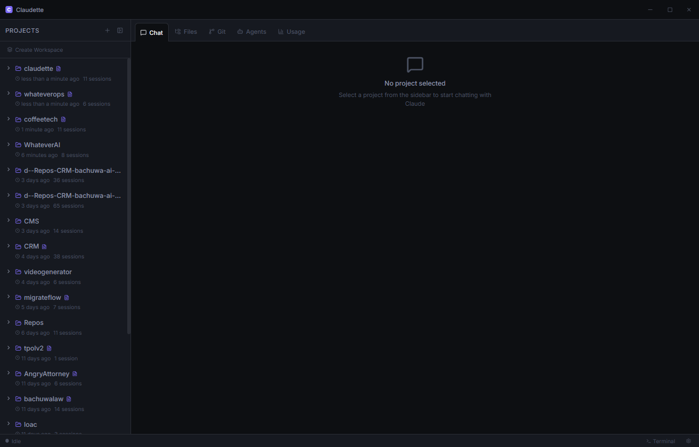
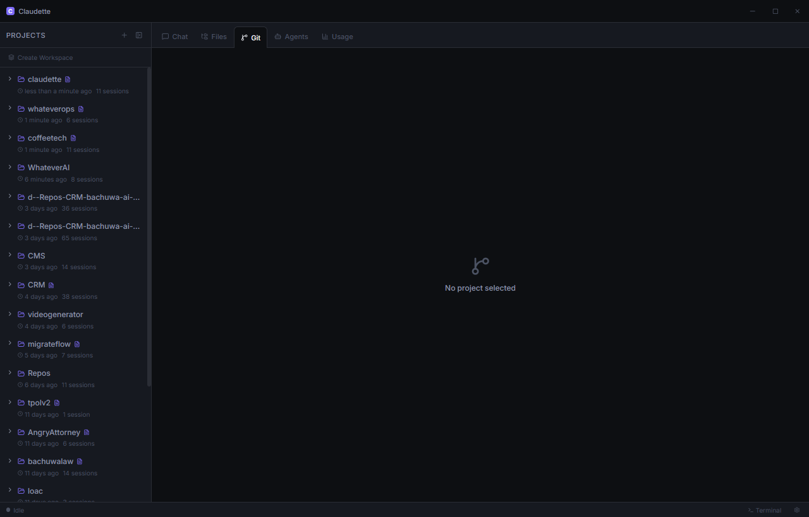
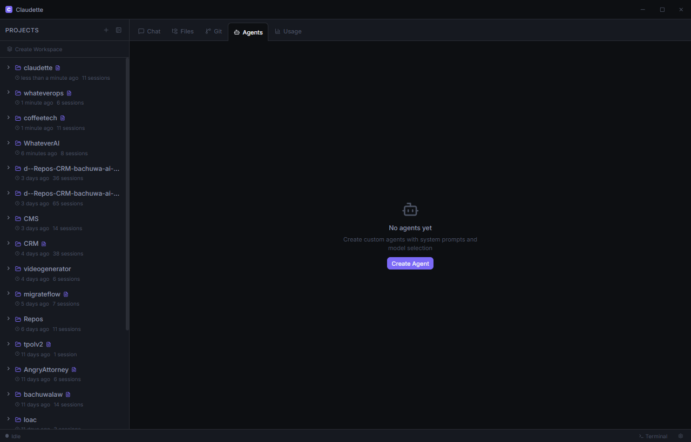
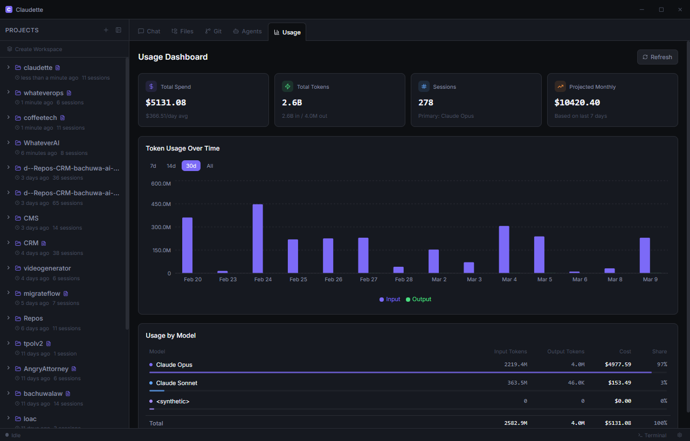

<div align="center">

<!-- Replace with actual banner once screenshots are ready -->


<h1>Claudette</h1>

<p><strong>The GUI that Claude Code should have shipped with.</strong></p>

<p>
  <a href="https://github.com/whateverai/claudette/releases"></a>
  <a href="https://github.com/whateverai/claudette/blob/main/LICENSE"></a>
  
  <a href="https://github.com/whateverai/claudette/stargazers"></a>
</p>

<p>
  <a href="#-installation">Install</a> ·
  <a href="#-features">Features</a> ·
  <a href="#-screenshots">Screenshots</a> ·
  <a href="#-contributing">Contributing</a>
</p>

</div>

---

Claudette is a free, open-source desktop app that wraps the Claude Code CLI in a beautiful visual interface. No new subscription needed — it uses your existing Claude Code account. Download the `.exe`, install, and you're coding with a real GUI in under 60 seconds.

> Built by [WhateverAI](https://whateverai.dev) · Powered by [Claude Code](https://claude.ai/code)

---

## ✨ Features

| | Feature | Details |
|---|---|---|
| 💬 | **Chat Panel** | Stream Claude responses in real time with full markdown rendering and syntax-highlighted code blocks |
| 📁 | **File Explorer** | Browse your project tree, open files with syntax highlighting, see live changes as Claude edits |
| 🔀 | **Git Integration** | View diffs, stage files, write commit messages, and commit — all without leaving the app |
| 📝 | **CLAUDE.md Editor** | Monaco-powered editor with live preview for your project instructions |
| 🤖 | **Custom Agents** | Create reusable agents with custom system prompts, model selection, and tool permissions |
| 📊 | **Usage Dashboard** | Track token consumption and estimated costs with daily charts |
| 🖥️ | **Embedded Terminal** | Drop into raw CLI mode any time without switching windows |
| 🔄 | **Session History** | Resume any past conversation, browse history, never lose context |
| ⚡ | **Windows Native** | Proper `.exe` installer, no WSL, no build-from-source, no Rust required |

---

## 🚀 Installation

### Windows (Recommended)
1. Download `Claudette-Setup.exe` from the [latest release](https://github.com/whateverai/claudette/releases/latest)
2. Run the installer
3. Open Claudette — it auto-detects your Claude Code CLI

**Requirement**: [Claude Code](https://docs.anthropic.com/en/docs/claude-code/overview) must be installed first.

### macOS
Download `Claudette.dmg` from [releases](https://github.com/whateverai/claudette/releases/latest).

### Linux
Download `Claudette.AppImage` from [releases](https://github.com/whateverai/claudette/releases/latest).

---

## 📸 Screenshots

<table>
  <tr>
    <td></td>
    <td></td>
  </tr>
  <tr>
    <td><em>Chat with real-time streaming</em></td>
    <td><em>Visual git diff & commit</em></td>
  </tr>
  <tr>
    <td></td>
    <td></td>
  </tr>
  <tr>
    <td><em>Custom agent creation</em></td>
    <td><em>Token usage analytics</em></td>
  </tr>
</table>

---

## 🔧 How It Works

Claudette is a thin UI layer over the Claude Code CLI. It:
1. Spawns `claude` as a child process
2. Streams stdout/stderr to the chat panel in real time
3. Reads `~/.claude/projects/` to discover your sessions
4. Uses `simple-git` to power the git panel
5. Uses Monaco Editor for the CLAUDE.md editor

Your API keys and subscription stay exactly where they are — in Claude Code's own config. Claudette never touches them.

---

## 🛠️ Development

```bash
# Clone
git clone https://github.com/whateverai/claudette.git
cd claudette

# Install dependencies
npm install

# Start dev server
npm run start

# Build installer
npm run dist:win   # Windows .exe
npm run dist:mac   # macOS .dmg
npm run dist       # all platforms
```

**Requirements**: Node.js 18+, Claude Code CLI installed

---

## 🤝 Contributing

Contributions are very welcome. Please read [CONTRIBUTING.md](CONTRIBUTING.md) first.

**Good first issues**: check the [`good-first-issue`](https://github.com/whateverai/claudette/issues?q=label%3Agood-first-issue) label.

---

## 🗺️ Roadmap

- [ ] Windows `.exe` installer (v0.1)
- [ ] Chat + terminal + session history (v0.1)
- [ ] File explorer + Git panel (v0.2)
- [ ] CLAUDE.md editor + Agents (v0.2)
- [ ] Usage dashboard (v0.3)
- [ ] MCP server manager (v0.4)
- [ ] Multi-project workspace (v0.4)
- [ ] Auto-updater (v0.5)

---

## 📄 License

MIT © [WhateverAI](https://whateverai.dev)

---

<div align="center">
  <sub>Built with Claude Code · Made with ❤️ by <a href="https://whateverai.dev">WhateverAI</a></sub>
</div>
